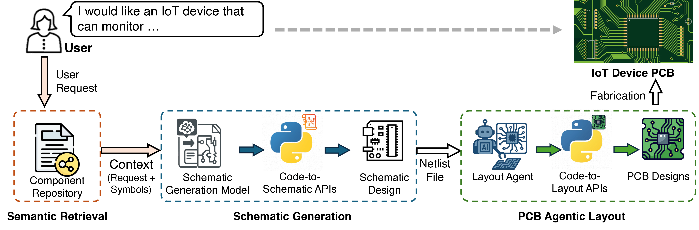
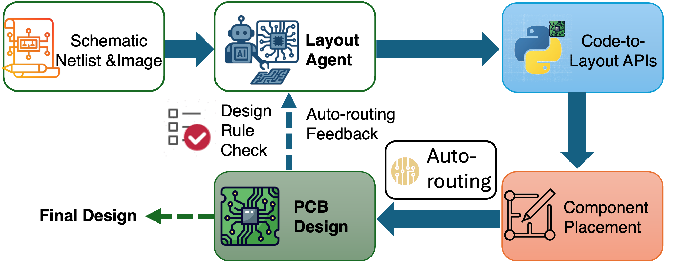

# IoTGen: Towards LLM-Driven IoT Hardware Generation

IoTGen is an LLM-driven framework for automated IoT PCB design generation.
It supports:
- Semantic component retrieval from KiCad libraries
- Natural-language-to-schematic generation
- Agentic PCB layout generation and wiring

The framework integrates LLM reasoning with programmatic PCB interfaces to enable rapid prototyping of IoT hardware systems.



To cite this project and corresponding paper, please use the following bib item:
```
@inproceedings{10.1145/3745756.3809239,
author = {Luo, Qinpei and Ma, Ruichun and Zhang, Xinyu and Qiu, Lili},
title = {IoTGen: Towards LLM-Driven IoT Hardware PCB Generation},
year = {2026},
isbn = {9798400720277},
publisher = {Association for Computing Machinery},
address = {New York, NY, USA},
url = {https://doi.org/10.1145/3745756.3809239},
doi = {10.1145/3745756.3809239},
booktitle = {Proceedings of the 24th Annual International Conference on Mobile Systems, Applications and Services},
keywords = {IoT, PCB design, schematic generation, large language model, electronic design automation, hardware generation},
location = {Cambridge, United Kingdom},
series = {MobiSys '26}
}
```

## Get Started

### Prerequisites

1. **LLM Model Access**

    **OpenRouter**: In the ``./config.py``, replace the variable of ``openrouter_api_key`` with your own API key.

2. **Python Environment**
    <details>
    <summary> Instructions </summary>
    
    (1) Set up a python virtual environment (Python 3.10 and Conda suggested) for the project. You can refer to the [Tutorial](https://code.visualstudio.com/docs/python/environments).

    (2) Enter your virtual environment and install python packages with:
    
    `pip install torch torchvision torchaudio --index-url https://download.pytorch.org/whl/cu128`

    `pip install -r ./requirements.txt`

    (3) Set up project path environment variable under the virtual environment

    ``conda env config vars set PROJECT_PATH={YOUR_PROJECT_PATH} && conda deactivate && conda activate {YOUR_CONDA_ENV}``

    (4) Set up GPT fine tuning, follow [Blog here](https://cookbook.openai.com/articles/gpt-oss/fine-tune-transfomers).


    (5) The path of Python interpreters used by KiCad on different systems are specified in ``./config.py``. The configurations are based on normal default settings for each OS, but may need to be adjusted based on the user's specific installation paths.


    **TL;DR**
    All commands to run for setting up the environment below
    ```
    # 1) Create and activate the env
    conda create -n [YOUR_CONDA_ENV] python=3.10 -y
    conda activate [YOUR_CONDA_ENV]

    # 2) Install deps
    pip install --upgrade pip
    pip install -r requirements.txt

    # 3) Set PROJECT_PATH of Conda environment
    conda env config vars set PROJECT_PATH={YOUR_PROJECT_PATH} && conda deactivate && conda activate {YOUR_CONDA_ENV}

    # 4) For GPT fine tuning

    pip install "trl>=0.20.0" "peft>=0.17.0" "transformers>=4.55.0" trackio
    pip install -U flash-attn

    #Optional: login hugging face
    from huggingface_hub import notebook_login
    notebook_login()
    ```

</details>

3. **KiCad v8 Installation**
    <details>
    <summary> Instructions </summary>

    Install version 8.0.9 from [Github KiCad releases](https://github.com/KiCad/kicad-source-mirror/releases) 

    Direct installer download link here:  
    [Windows](https://github.com/KiCad/kicad-source-mirror/releases/download/8.0.9/kicad-8.0.9-x86_64.exe)  
    [Mac](https://github.com/KiCad/kicad-source-mirror/releases/download/8.0.9/kicad-unified-universal-8.0.9.dmg)

    To install kicad v8 on ubuntu
    ```
        sudo add-apt-repository --yes ppa:kicad/kicad-8.0-releases
        sudo apt update
        sudo apt install --install-recommends kicad
    ```

   #### Freerouting Installation

   IoTGen uses Freerouting for automatic PCB routing.

   **macOS & Windows** Install the KiCad Freerouting plugin from: https://github.com/freerouting/freerouting

   Or you can also download it from the ``Plugin and Content Manager`` in KiCad software.

   **Ubuntu**
   ```bash
   sudo apt install default-jre
   wget https://github.com/freerouting/freerouting/releases/download/v2.1.0/freerouting-2.1.0.jar
   ```
   Then configure the `freerouting_jar_path` and `freerouting_plugin_path` in `./config.py`.

   </details>

### Tests

To test whether you have set up environment correctly:

1. Run `./modules/utils/llm_interface.py` to test the LLM model access  
2. Run `./modules/kicad_sch_interface.py` to test python-based KiCad schematic editing test.

These scripts have a main function implemented for testing purposes.

### KiCad Usage

1. Open KiCad project by clicking the project file. For example:  
   `./KiCAD_Project/example_project.kicad_pro`

2. You will see a KiCad main project window showing up. In the window, click KiCad schematic file to view current schematic in a separate window. For example:  
   `example_project.kicad_sch`

3. IoTGen relies on KiCad's bundled Python environment for PCB manipulation. Default setting is specified for different systems in ``./config.py``, however, you may need to check on them and make necessary changes.

## Step by Step Guide

All of the following commands are executed under the ``PROJECT_PATH`` as you specify.

### 1. Semantic Retrieval

#### 1.1 Build symbol repository

1. Prepare symbol and footprint information from ``.kicad_sym`` files from KiCad with the following commands:

```
mkdir export
python ./modules/utils/kicad_scan_lib.py
```

You should see two files of ``organized_fp.json`` and ``organized_lib.json`` under the folder ``./export``.

2. Read symbol's basic information

```
python ./PCB_Semantic_Retrieval/read_lib.py
```

3. Re-organize symbol repository by hierarchical clustering

```
python ./PCB_Semantic_Retrieval/categorize_lib.py ./PCB_Semantic_Retrieval/symbol_index.jsonl --out ./PCB_Semantic_Retrieval/component_repository.json
```

(Optional) Merge the symbol repository to avoid duplicate entries

```
  python ./PCB_Semantic_Retrieval/merge_tree.py \
      --taxonomy ./PCB_Semantic_Retrieval/component_repository.taxonomy.json \
      --tree ./PCB_Semantic_Retrieval/component_repository.json \
      --out-taxonomy ./PCB_Semantic_Retrieval/component_repository.taxonomy.json \
      --out-tree ./PCB_Semantic_Retrieval/component_repository.json
```

4. Extend the symbol information by calling external LLM

```
python ./PCB_Semantic_Retrieval/symbol_extension.py --input_jsonl ./PCB_Semantic_Retrieval/symbol_index.jsonl --output_jsonl ./PCB_Semantic_Retrieval/symbol_info.jsonl
```

5. Build the SQLite and FTS5 database for symbol searching

```
python ./PCB_Semantic_Retrieval/symbol_search.py build --input_jsonl ./PCB_Semantic_Retrieval/symbol_info.jsonl --index_dir .cache_symbol_index
```

#### 1.2 Component Query

```
python ./PCB_Semantic_Retrieval/query_sym.py --user_query "I need a linear voltage regulator for a 5V power supply".
```

#### 1.3 User Verification

The retrieved components should be reviewed by the user before schematic generation A vague natural-language request may correspond to multiple possible hardware implementations. If the retrieved components are not appropriate, users are encouraged to revise the input request and rerun the retrieval stage.

### 2. Schematic Generation

We provide two ways to generate PCB schematics.
1. From dataset entry
```
python ./PCB_Schematic_Generation/generate.py --test_dataset --index {DATASET_INDEX}
```
The dataset is available on Huggingface at [microsoft/SchGen_dataset](https://huggingface.co/datasets/microsoft/SchGen_dataset).

2. From direct user request input
```
python ./PCB_Schematic_Generation/generate.py --test_raw --prompt {User_Request}
```

The shcematic generation model is loaded from [microsoft/SchGen](https://huggingface.co/microsoft/SchGen) by assigning PEFT model id as ``peft_model_id = "microsoft/SchGen"`` in ``./PCB_Schematic_Generation/generate.py``.
The default path of generated Python code representation of the schematic is at ``./PCB_Schematic_Generation/generated.py``, but you can replace it with your own path.

After generating the code, you can create the project and the corresponding schematic by executing

```
python ./init_project.py {YOUR_PROJECT_NAME} {YOUR_CODE_PATH}
```

#### 2.1 User Verification

Although IoTGen can automatically generate PCB schematics from natural-language requests, the generated design may still contain incorrect connections, component selections, or layout inconsistencies.

Users should inspect the generated schematic in KiCad before proceeding to PCB layout generation.   
If necessary, users can revise the request or manually modify the generated schematic/code and rerun the workflow.

### 3. PCB Agentic Layout



Specify the project path and project name (KiCad schematic and PCB names). You can also specify the model name and provider, although they are already set with default values in ``PCB_Agentic_Layout/layout_agent.py``. The agentic layout can be executed with the following command:

```
python ./PCB_Agentic_Layout/layout_agent.py --project_path {YOUR_PROJECT_PATH} --project_name {YOUR_PROJECT_NAME}
```

#### 3.1 User Verification

The generated PCB layout should be manually reviewed before fabrication.

Users are encouraged to inspect:
- component placement
- routing quality
- design-rule violations
- grounding and power distribution

IoTGen integrates automated routing tools and iterative refinement, but does not guarantee fabrication-ready PCB designs without human review.


### Example: Generate a 3.3V LED Circuit

This example demonstrates the end-to-end workflow using a simple user request:

```text
I want an LED circuit driven by 3.3V.
```

#### 1. Generate schematic code

```bash
python ./PCB_Schematic_Generation/generate.py \
    --test_raw \
    --prompt "I want an LED circuit driven by 3.3V."
```

The generated Python schematic code will be saved to the default path:

```bash
./PCB_Schematic_Generation/generated.py
```

#### 2. Create the KiCad project and schematic

```bash
python ./init_project.py led_3v3 ./PCB_Schematic_Generation/generated.py
```

This command creates a KiCad project named `led_3v3` and executes the generated schematic code to produce the corresponding `.kicad_sch` file.

#### 3. User verification

Open the generated schematic in KiCad and check that:

- the LED is connected to the 3.3V rail through a current-limiting resistor;
- the LED cathode is connected to GND;
- the resistor value is reasonable for a 3.3V LED circuit;
- the schematic has no obvious missing or incorrect connections.

If the result is not satisfactory, revise the prompt or manually edit the generated schematic/code before proceeding.

#### 4. Run PCB layout generation

```bash
python ./PCB_Agentic_Layout/layout_agent.py \
    --project_path ./led_3v3 \
    --project_name led_3v3
```

After layout generation, inspect the PCB in KiCad before exporting manufacturing files.


## Export Gerber Files

After PCB layout generation is completed, you can export Gerber manufacturing files from KiCad.

### Using KiCad GUI

1. Open the generated `.kicad_pcb` file in KiCad PCB Editor.
2. Click:

   `File -> Fabrication Outputs -> Gerbers (.gbr)`

3. Recommended layers:
   - F.Cu
   - B.Cu
   - F.SilkS
   - B.SilkS
   - F.Mask
   - B.Mask
   - Edge.Cuts

4. Click **Plot**.

5. Then generate drill files:

   `File -> Fabrication Outputs -> Drill Files`

6. Click **Generate Drill File**.

The generated Gerber and drill files can then be submitted to PCB manufacturers such as:
- JLCPCB
- PCBWay
- OSH Park
- Seeed Studio

### Export Gerber from Command Line

KiCad also supports command-line Gerber export:

```bash
kicad-cli pcb export gerbers YOUR_BOARD.kicad_pcb --output gerbers/
```

## Disclaimer

The generated schematics and PCB layouts should always be reviewed by experienced engineers before fabrication or deployment.

IoTGen is intended for rapid prototyping and research purposes, and does not guarantee electrical correctness or manufacturability. Human review is required before manufacturing or deployment.

## License

This project is released under the MIT License.
